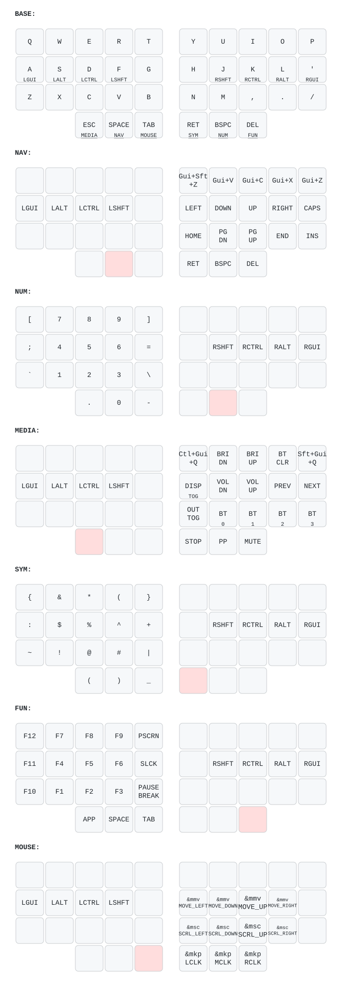

<!-- FilePath: README.md -->

# Corne ZMK Keymap

Split ergonomic keyboard (42 keys) running [ZMK firmware](https://zmk.dev) on Nice!Nano v2.
Miryoku-style layout adapted from TOTEM config.

## Keymap

Auto-generated from [`config/yuyudhan-1.keymap`](config/yuyudhan-1.keymap) and [`config/yuyudhan-2.keymap`](config/yuyudhan-2.keymap) via [keymap-drawer](https://github.com/caksoylar/keymap-drawer):

### yuyudhan-1

### yuyudhan-2


Regenerate after editing a keymap — `just build <keymap>` (or `just svg <keymap>`) re-renders its SVG; see [Build Firmware](#build-firmware) below.

## Display

- **Left (central):** Built-in ZMK status screen — output (USB/BT profile), battery %, active layer, and WPM
- **Right (peripheral):** Custom Trishul logo + battery % + split/BT status

## Interactive Viewer

```sh
just html <keymap>                         # regenerate <keymap>-viewer.html (default yuyudhan-1)
make viewer KEYMAP=config/<keymap>.keymap  # open in browser
```

Press `?` for the cheat sheet. Press `0-6` to switch layers.

## Build Firmware

Firmware builds locally via [`just`](https://github.com/casey/just) + Docker — no cloud CI needed.
Requires `just` and Docker Desktop (running).

```sh
just build                         # yuyudhan-1, all targets -> firmware/yuyudhan-1/<datetime>/
just build yuyudhan-2              # yuyudhan-2, all targets
just build yuyudhan-1 left right   # specific keymap + halves
just check yuyudhan-1              # verify that keymap's viewer matches
just clean                         # wipe west workspace + build cache
```

The **first positional arg is the keymap** (default `yuyudhan-1`); targets follow.
`just build` also regenerates that keymap's `<keymap>_keymap.svg` and warns if `<keymap>-viewer.html` has drifted, and copies both into the build's `firmware/<keymap>/<datetime>/` directory alongside the `.uf2`s.

Targets: `left` `right` `left_view` `right_view` `reset`. Outputs land in `firmware/<keymap>/<datetime>/`
(e.g. `firmware/yuyudhan-1/2026-06-26_14-30-05/`), **gitignored — not committed**, containing
`corne_left.uf2`, `corne_right.uf2`, `corne_left_nice_view.uf2`, `corne_right_nice_view.uf2`, `settings_reset.uf2`. When keymap-drawer is installed the directory also contains `<keymap>_keymap.svg` and `<keymap>-viewer.html` as a snapshot of the keymap visuals at build time.

### Flash

1. Double-tap the reset button on a half → it mounts as the `NICENANO` USB drive.
2. Drag the matching `.uf2` from the newest `firmware/<keymap>/<datetime>/` directory onto it; it reboots automatically.
3. Repeat for the other half. Reflash **both** halves after any `config/` change.

Or run `just flash <keymap> <target>` (both args required — flashing is destructive) once a half is
mounted as `NICENANO`; it copies the newest matching `.uf2` from `firmware/<keymap>/` automatically.
Example: `just flash yuyudhan-1 left`. Targets: `left right left_view right_view reset`.

## Regenerate Keymap SVG

```sh
make install   # one-time: pip install keymap-drawer==0.23.0
just svg <keymap>               # parse + render <keymap>_keymap.svg (default yuyudhan-1)
# or: make svg KEYMAP=config/<keymap>.keymap
```

> Alternatively, isolate it with pipx: `pipx install --python python3.12 keymap-drawer==0.23.0`

## Hardware

- **Board:** Nice!Nano v2 (nRF52840)
- **Shield:** Corne (split, 6x3+3)
- **Display:** OLED SSD1306 128x32 / Nice!View
- **RGB:** Disabled (no LEDs installed)
- **Bluetooth:** 4 profiles
- **ZMK Studio:** Enabled
- **Mouse/Pointing:** Enabled
